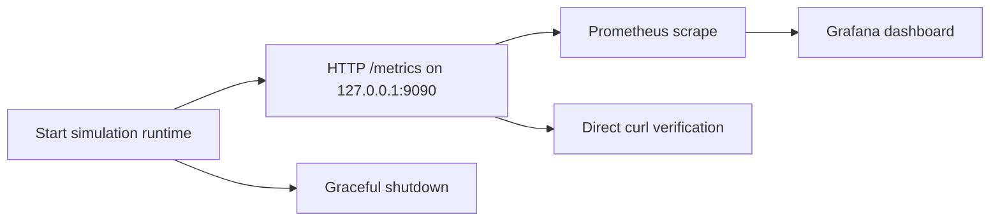

# LUV Flicker Pilot

## A monitorable trading-system integration surface on day one

LUV Flicker is a C++20, simulation-oriented market-data and execution framework with a live Prometheus-compatible metrics endpoint. A pilot operator can start the runtime, inspect metrics directly, and load a Grafana dashboard without building a custom monitoring adapter.

## Day-one operator flow



## Start the pilot

```sh
cmake -S . -B build -DCMAKE_BUILD_TYPE=Debug
cmake --build build -j2
./build/main_engine --metrics
```

Verify the live surface:

```sh
curl http://127.0.0.1:9090/metrics
```

Then use:

- [Prometheus scrape config](prometheus_luv_scrape.yml)
- [Grafana dashboard](grafana_luv_dashboard.json)
- [Operator metrics guide](OPS_METRICS_GUIDE.md)

## What the operator sees

The endpoint exposes the core runtime signals needed for a first pilot:

- session PnL and gross exposure
- fill and rejected-order counters
- active orders
- tick rate
- inference latency
- risk-check latency
- halted state through the runtime telemetry model

In the verified local run, a live scrape returned `luv_active_orders 64` and `luv_risk_ns 99.000` while the process was running. The process then shut down cleanly after `Ctrl-C`, reporting 740 processed orders.

## Evidence available today

- Real TCP HTTP server, not only a renderer function
- Prometheus exposition format verified by an integration test
- Live scrape verified with `curl`
- Grafana import artifact included
- Operator runbook included
- Clean shutdown path exercised during the live run

## Pilot boundary

This package supports controlled integration testing and operational discovery. It is not a production trading approval, exchange certification, or recommendation to connect real capital. Before production use, independently complete exchange integration, packet-gap recovery, authenticated execution reconciliation, external audit retention, failover testing, hardware validation, and required legal and risk reviews.

## Suggested pilot conversation

> Here is the first-day operator experience: start the simulation, scrape the runtime, import the dashboard, and inspect live order, fill, exposure, and risk-latency signals. The next step is to agree on one controlled integration workflow and the evidence required to graduate it.
